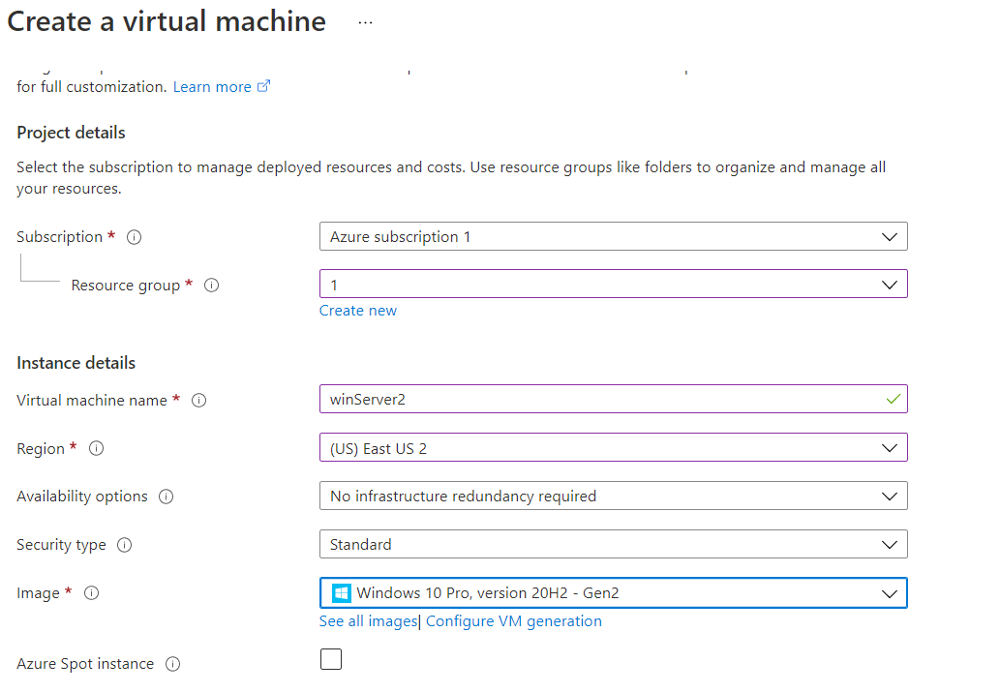
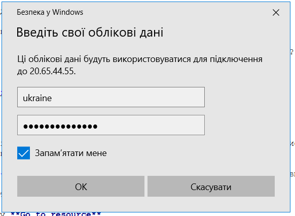
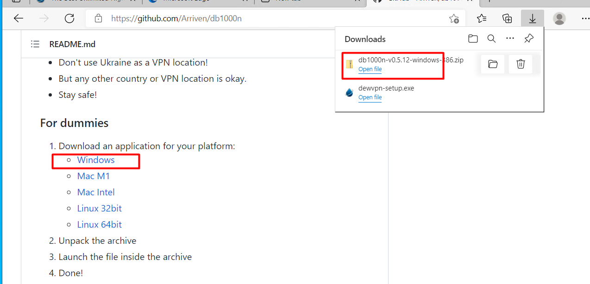
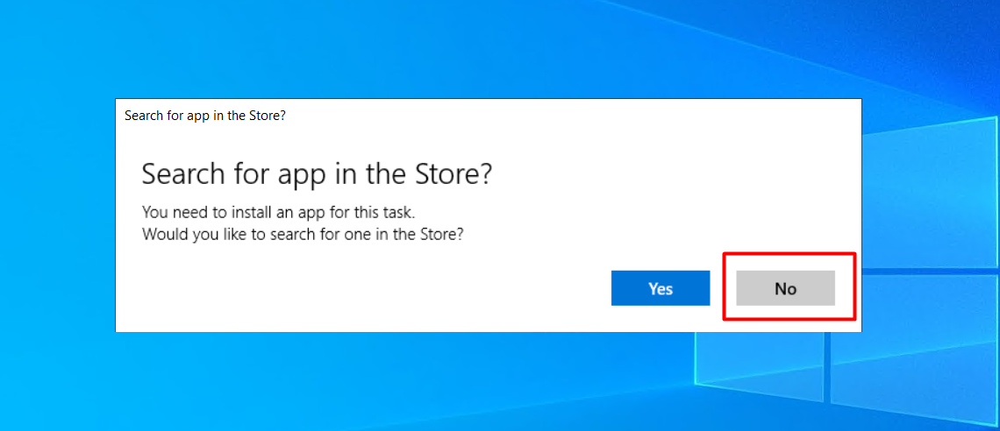

# Мануал по запуску виділеного серверу з win10 на microsoft azure

Перще що потрібно пояснити, це навіщо виділений сервер. Коли ви ддосите зі свого комп'ютера 
через впн то нагружається також мережа України. А це наші сайти, сервіси і інші ресурси - в них також сповільнюється робота.

Виділений сервер фізично знаходиться в іншій країні - тому український трафік не чіпається.

В цій інструкції використовується виділений сервер на базі Microsoft Azure, там при реєстрації дається 200$ на використання послуг які треба використати в період 30 днів. 
Їх буде достатньо щоб запустити 2 виділених сервери строком на 1 місяць.

## Регістрація на Microsoft Azure

Для реєстрації буде потрібно діючий номер телефону та банківська карта (може підійти наприклад інтернет-карта привату).

Ідемо на сайт https://azure.microsoft.com/ і жмемо **start free**

Далі вам потрібно буде увійти в обліковий запис microsoft або створити його якщо в вас його немає. 

В процесі реєстрації вписуємо номер телефону і на нього прийде код підтвердження,

також вписуємо дані карти - з неї спишеться і потім повернеться 1$

З іншим при реєстрації не повинно виникнути проблем. якщо ви не можете зарєєструватися на сайті - то що ви тут робите? )))

## Створення virtual mashines

Далі ви повинні попасти на панель керування https://portal.azure.com/#home

Натискаємо створити віртуальну машину

Створюємо Resourse group якщо іще не створена, даємо назву віртуальній машині, вибираємо регіон в якому буде знаходитися наш сервер (тут можуть бути різні варіанти, вибирайте самі)
Далі обираємо систему яка буде встановлена. нам буде достатньо windows 10 pro за 70$ в місяць. 

Далі заповнюємо логін і пароль адміністратора (там є вимоги - дивиомсь підказки) та обираємо порт для підключення до виділенного серверу. порт обирайте **RDP(3389)**
ставимо галочку ліцензії
натискаємо кнопку **Review + create**  і чекаємо коли буде створена наша віртуальна машина.

Коли буде створена переходимо до параметрів натиснувши кнопку **Go to resource**

далі натискаємо **connect - RDP**

і скачуємо файл натиснувши на кнопку **Download RDP File**

запускаємо скачаний файл 
 
 
 
вводимо логін і пароль адміністратора які ми писали при створвенні віртуальної машини

підтверджуємо сертифікати

і далі відкриється вікно першого входу на встановлений віндовс. нажимаємо **Accept**

Вітаю вас - віртуальна машина створена!

Далі потрібно встановити впн та программу db1000n

## Встановлення VPN

Тут э величезна варіативність. VPN ви можете встановлювати такий який подобається вам. Я буду встановлювати на прикладі **dewVPN**

На виділеному сервері заходимо в браузер і відкриваємо https://www.dewvpn.com/ скачуємо та встановлюємо. 

нажимаємо choose location - вибираємо russia і нажимаємо ON
якщо російські сервери не запускається - вибираємо іншу країну.

## Встановлення програми db1000n 

Далі заходимо на сторінку https://github.com/Arriven/db1000n гортаємо вниз і скачуємо версію для windows 

відкриваємо архів. Для зручності можемо перетягнути файл програми на робочій стіл

залишається тільки запустити файл программи з робочого столу подвійним кліком мишки - вас може запитати чи потрібно шукати в магазині - нажимаємо ні

Все!!! Програма запущена і працює!!!

