# Azure

## Мануал по запуску виділеного серверу з Windows 10 на Microsoft Azure

24-го лютого росія почала повномасштабне вторгнення в Україну. Ми робимо все можливе щоб не дозволити подальше пролиття невинної крові

Перще що потрібно пояснити, це навіщо потрібен виділений сервер.
Коли ви ддосите зі свого комп'ютера через впн, то нагружається також мережа України.
А це наші сайти, сервіси і інші ресурси - в них також сповільнюється робота.

Виділений сервер фізично знаходиться в іншій країні - тому український трафік йде з цієї країни.

В цій інструкції використовується виділений сервер на базі Microsoft Azure, там при реєстрації дається $200 на використання послуг які треба використати в період 30 днів.
Їх буде достатньо щоб запустити 2 виділених сервери строком на 1 місяць.

## Реєстрація на Microsoft Azure

Для реєстрації буде потрібно мати діючий номер телефону та банківська карта (може підійти наприклад інтернет-карта привату).

Ідемо на сайт [Azure](https://azure.microsoft.com/) і жмемо `Start free`:

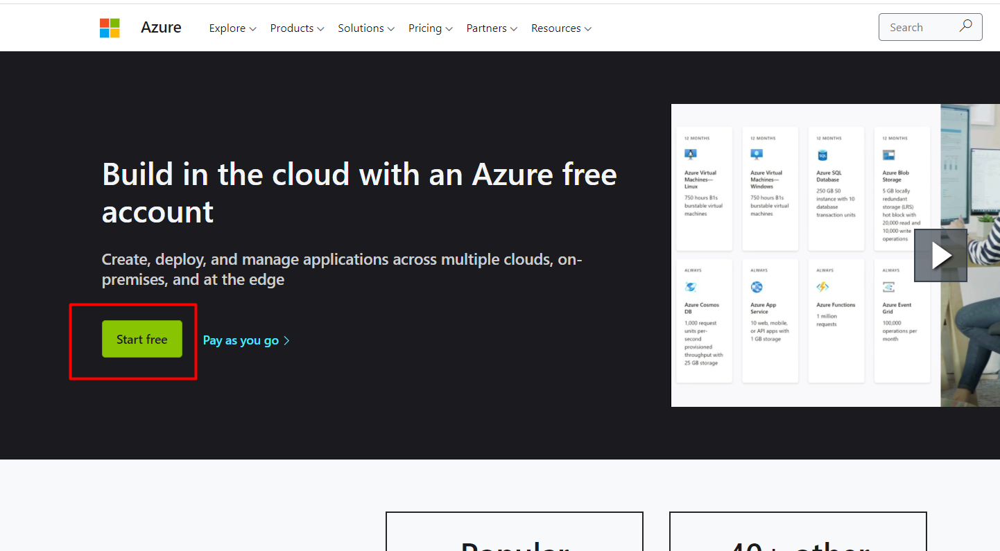

Далі вам потрібно буде увійти в обліковий запис microsoft або створити його якщо в вас його немає:

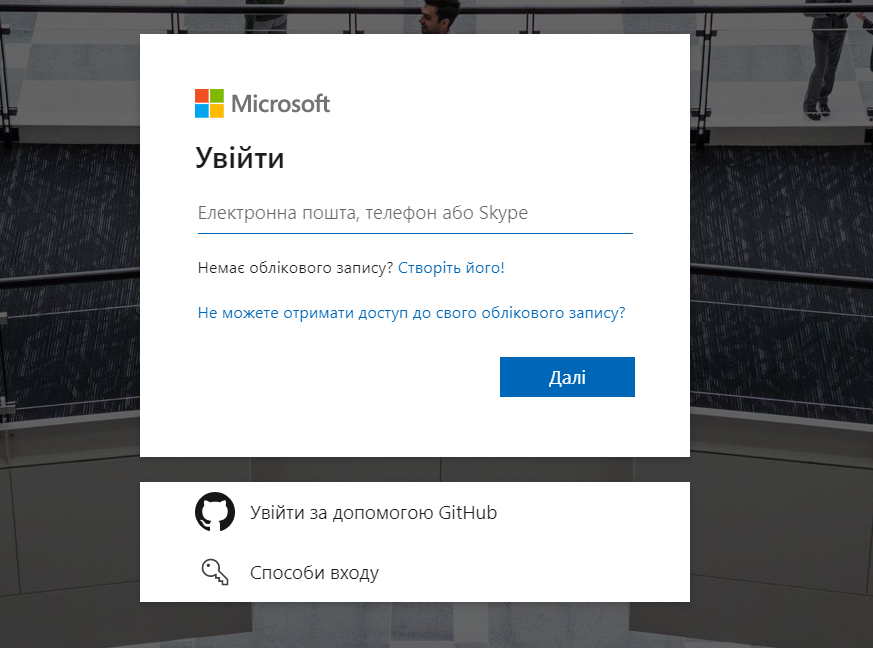

В процесі реєстрації вписуємо номер телефону і на нього прийде код підтвердження, також вписуємо дані карти - з неї спишеться і потім повернеться $1.

## Створення Virtual Machines

Далі ви повинні попасти на [панель керування Azure](https://portal.azure.com/#home)

Натискаємо створити віртуальну машину:

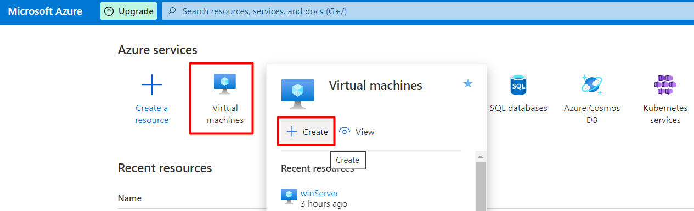

Створюємо Resourse group якщо ще не створена, даємо назву віртуальній машині, вибираємо регіон в якому буде знаходитися наш сервер (тут можуть бути різні варіанти, вибирайте самі).
Далі обираємо систему яка буде встановлена, нам буде достатньо Windows 10 Pro за $70 в місяць:

Далі заповнюємо логін і пароль адміністратора (там є вимоги - дивимось підказки) та обираємо порт для підключення до виділенного серверу. Порт обирайте `RDP(3389)`.
Ставимо галочку ліцензії, натискаємо кнопку `Review + create` і чекаємо коли буде створена наша віртуальна машина:

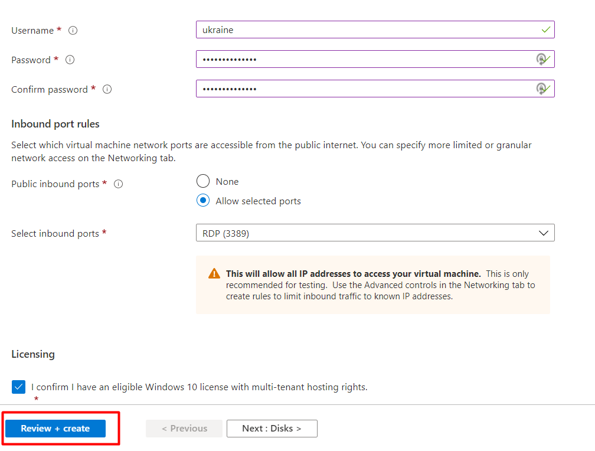

Коли ВМ буде створена, переходимо до параметрів натиснувши кнопку `Go to resource`:

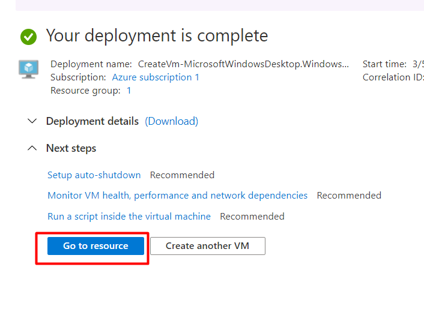

Далі натискаємо `Connect - RDP`:

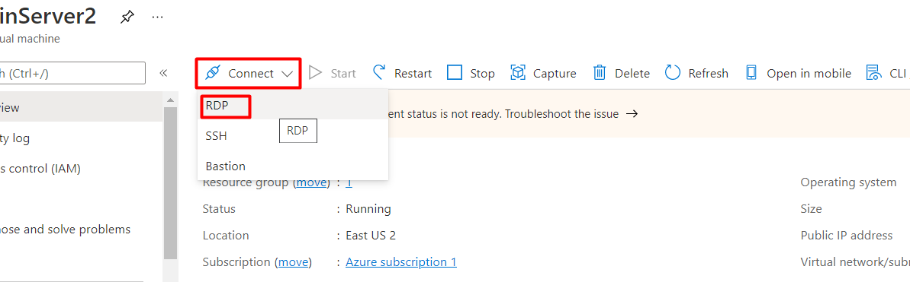

І скачуємо файл натиснувши на кнопку `Download RDP File`:

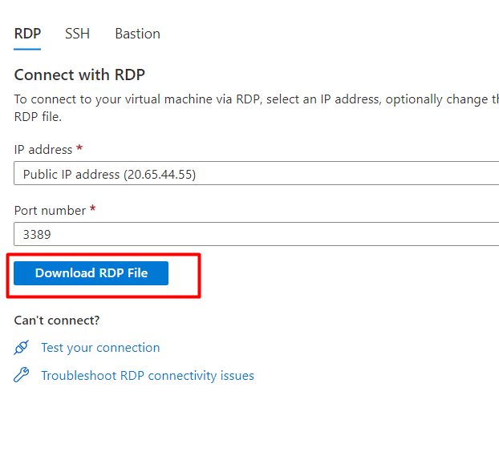

Запускаємо скачаний файл

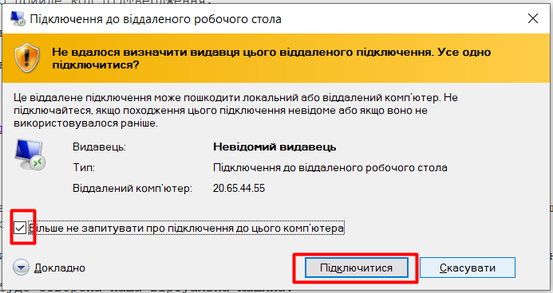

Вводимо логін і пароль адміністратора які ми писали при створвенні віртуальної машини:

Підтверджуємо сертифікати:

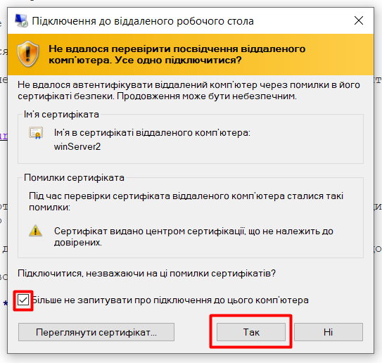

І далі відкриється вікно першого входу на встановлений Windows.
Натискаємо `Accept`:

Вітаю вас - віртуальна машина створена!

Далі потрібно встановити VPN та программу `db1000n`.

## Встановлення VPN

Тут є величезна варіативність.
VPN ви можете встановлювати такий який подобається вам.
Я буду встановлювати на прикладі `dewVPN`.

На виділеному сервері заходимо в браузер і відкриваємо [dewvpn.com](https://www.dewvpn.com/) скачуємо та встановлюємо.

Нажимаємо `Choose location` - вибираємо Russia і нажимаємо ON.
Якщо російські сервери не запускається - вибираємо іншу країну.

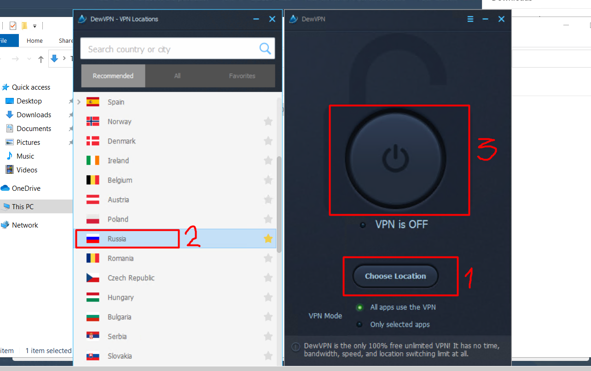

## Встановлення програми db1000n

Далі заходимо на сторінку [db1000n](https://github.com/Arriven/db1000n) гортаємо вниз і скачуємо версію для windows:

Відкриваємо архів.
Для зручності можемо перетягнути файл програми на робочій стіл:

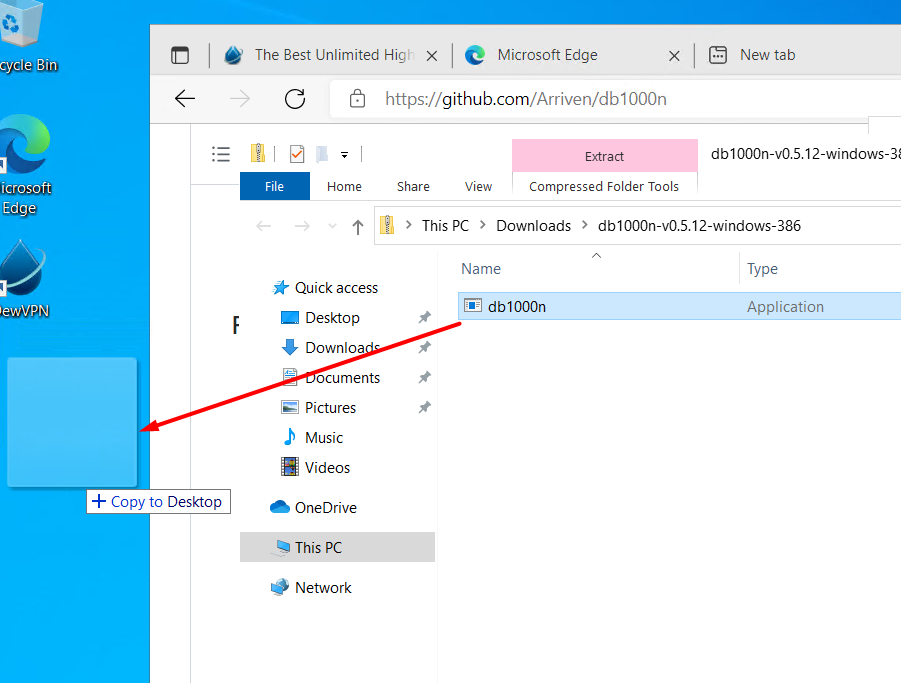

Залишається тільки запустити файл программи з робочого столу подвійним кліком мишки - вас може запитати чи потрібно шукати в магазині - нажимаємо ні:

Все!
Програма запущена і працює!

